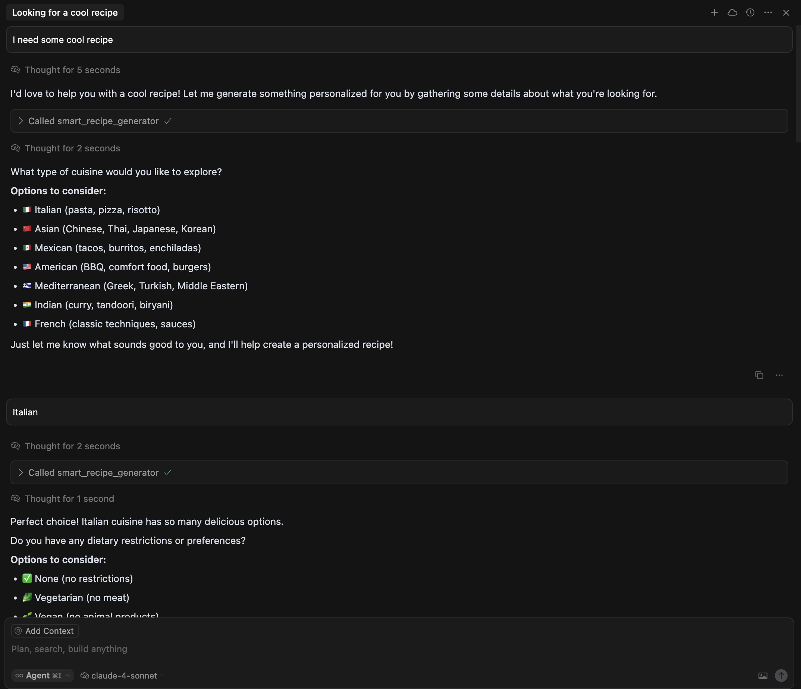

# MCP Tools Cookbook

A comprehensive collection of Model Context Protocol (MCP) tool patterns and recipes. This cookbook demonstrates various MCP design patterns that you can use as building blocks for your own AI-powered applications.

## 🧑‍🍳 Available Recipes (Patterns)

This cookbook demonstrates essential MCP tool patterns:

### 🎯 **Prompt Exposure Pattern**
- **`code_reviewer_prompt`** - Ready-to-use comprehensive code review prompts
- **`react_prompt_generator`** - Dynamic ReAct (Reason + Act) pattern prompt generation
- **Use case**: Transform MCP into a prompt repository service

### 🤔 **Clarification Questions Pattern**
- **`smart_recipe_generator`** - Progressive information gathering with intelligent questions
- **Use case**: Handle incomplete user input gracefully by asking targeted follow-up questions

### 🔄 **Multi-Step Tool Pattern**
- **`step1_initialize_workflow`** → **`step2_execute_workflow`** - Sequential tool dependencies
- **Use case**: Complex workflows requiring state management and ordered execution

### 🌐 **Client Tool Orchestration Pattern**
- **`sequential_web_search`** - Bridges external tools (like web_search) with MCP processing
- **Use case**: Extend and orchestrate native client tools from the server side

### 🎲 **Response-Driven Navigation Pattern**
- **`tool_with_follow_up`** - Tools that suggest next actions through embedded commands
- **`quantum_mood_analyzer`**, **`rubber_duck_debugger`**, **`coffee_brew_oracle`** - Fun example tools
- **Use case**: Guide conversation flow through tool response content

## 📸 Patterns in Action

See these MCP tool patterns demonstrated in real AI conversations:

### 🎯 Prompt Exposure Pattern

*The `code_reviewer_prompt` tool exposing a comprehensive, ready-to-use code review template*

### 🤔 Clarification Questions Pattern

*The `smart_recipe_generator` tool progressively gathering information through targeted questions*

### 🌐 Client Tool Orchestration Pattern

*The `sequential_web_search` tool orchestrating multiple web searches and processing results*

### 🎲 Response-Driven Navigation Pattern

*The `tool_with_follow_up` tool suggesting next actions, leading to `rubber_duck_debugger` execution*

## 🚀 Quick Start

### Setup Your Kitchen (Environment)

```bash
# Create virtual environment
python3 -m venv venv

# Activate virtual environment
source venv/bin/activate

# Install dependencies
pip install -r requirements.txt
```

**Or use the convenient activation script:**
```bash
source activate.sh
```


## 📖 Recipe Examples

### Using with AI Applications

Connect this cookbook to LLM applications that support MCP:

1. **Claude Desktop**: Add to your MCP configuration
2. **Cursor**: Add to your MCP configuration
3. **Custom LLM apps**: Use the FastMCP client
4. **Other MCP clients**: Any MCP-compatible client can use these patterns

### Claude Desktop Configuration Example

```json
{
  "mcpServers": {
    "mcp-tools-cookbook": {
      "command": "python",
      "args": ["path-to-repository/mcp_server.py"]
    }
  }
}
```

### Cursor Configuration Example

Add to your `~/.cursor/mcp.json` file:

```json
{
  "mcp-tools-patterns": {
    "command": "python",
    "args": [
      "path-to-repository/mcp_server.py"
    ]
  }
}
```

## 📝 License

This cookbook is provided as-is for educational purposes. Check the FastMCP repository for its license terms.
